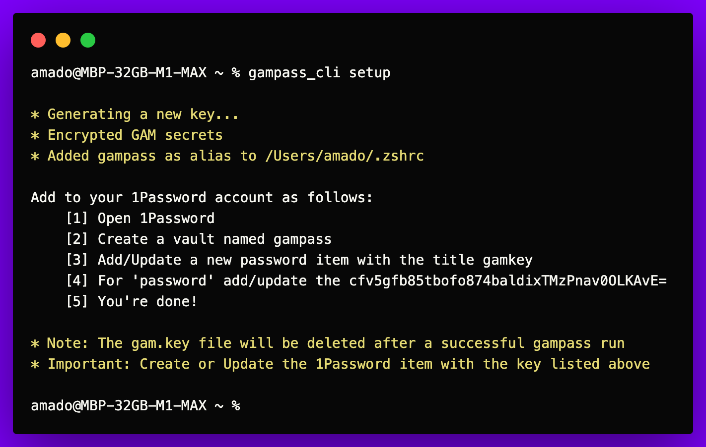

# GAMpass
##### Written by [Amado Tejada](https://www.linkedin.com/in/amadotejada/)

##
Many Google Workspace admins use [GAM](https://github.com/GAM-team/GAM) or [GAMADV-XTD3](https://github.com/taers232c/GAMADV-XTD3) to manage their instance. Currently, the secrets needed for these tools are stored on disk in plaintext.

*GAMpass* is a simple tool to encrypt & decrypt GAM secrets at runtime using your biometrics with [unopass](https://github.com/amadotejada/unopass)

## Requirements
-  python 3.13+
- `pip install -r requirements.txt`
- [unopass](https://github.com/amadotejada/unopass) configured 
- GAM/GAMADV-XTD3 configured

Tested on macOS 12.4+

## First time setup
**Back up your plaintext secrets in a different directory before you run setup.**
**Once you verify you can encrypt/decrypt secrets you can delete the backup.**

1. Meet the requirements
2. Move `gampass.py` to the same directory as GAM's secrets files, usually `~/.gam/`
3. Run `python gampass.py setup`*
    - this encrypts GAM all secrets
        - ["client_secrets.json", "oauth2service.json", "oauth2.txt"]
        - If you have multiple GAM domains, all will be encrypted
    - this will generate a new `gampass.key` file.
    - this adds `gampass` and `gampass_cli` alias to ~/.zshrc
        - if you don't use ~/.zshrc, adjust in `gampass.py`



4. Open 1Password
    - create a vault named `gampass`
    - add a new password item with the title `gamkey`
    - add the content of the `gampass.key` the `credential` field


## GAM Usage
Use this to make GAM calls

Put `gampass` before the GAM command

`gampass gam [gam args]`

```bash
gampass gam select domain2 save | gam info domain
```


* macOS Touch ID prompts for your biometrics decrypting the secrets


* GAM results

## GAMpass CLI Usage
Use only this to manage your GAM secrets

```bash
Usage: gampass_cli [option]

Options:
        encrypt                 Encrypt GAM all secrets
        decrypt                 Decrypt GAM all secrets
        setup                   Setup a key and encrypt secrets
        updates                 View updates documentation
        sync                    Encrypt all domains with existing 1Password key
Example:
        gampass_cli sync
```

## Limitations
Everything that works with GAM should work via *GAMpass*, except for the following:
 - Scheduled workflows via cron, etc., do not work because intentionally biometrics are prompted to decrypt the secrets.

##
### License

*GAMpass* is released under the [MIT License](https://github.com/amadotejada/GAMpass/blob/main/LICENSE)

####
