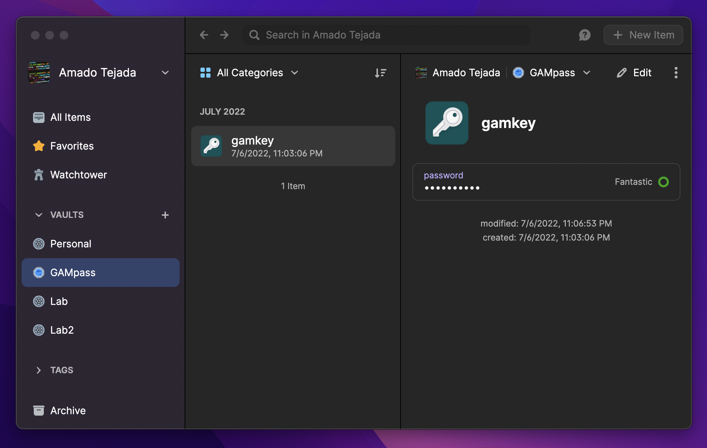

# GAMpass
##### Written by [Amado Tejada](https://www.linkedin.com/in/amadotejada/)

##
Many Google Workspace admins use [GAM](https://github.com/GAM-team/GAM) or [GAMADV-XTD3](https://github.com/taers232c/GAMADV-XTD3) to manage their instance. Currently the secrets needed for these tools are stored on disk in plaintext.

*GAMpass* is a simple tool to encrypt & decrypt GAM secrets at runtime using your biometrics with [unopass](https://github.com/amadotejada/unopass)

## Requirements
- `pip install -r requirements.txt`
- [unopass](https://github.com/amadotejada/unopass) configured 
- GAM configured

Only tested on macOS 12.4+

## First time setup

1. Meet the requirements
2. Move `gampass.py` to the same directory as GAM's secrets files.
3. Run `python gampass.py generate`
    - this encrypts GAM secrets
        - ["client_secrets.json", "oauth2service.json", "oauth2.txt"]
    - this will generate a new `gampass.key` file.
    - this adds `gampass` alias to ~/.zshrc
        - if you don't use ~/.zshrc, adjust in `gampass.py`


4. Open 1Password
    - create a vault named `gampass`
    - add a new PASSWORD item with the title `gam`
    - add the content of the `gampass.key` the `credential` field



## Usage
Put `gampass` before the gam command

`gampass [gam] [gam args]`

```bash
gampass gam info domain
```


macOS Touch ID prompts for your biometrics decrypting the secrets


GAM results. GAMpass encrypts the secrets with the latest key automatically in the background.

## Limitations
Eveyrything that works with GAM will work with *GAMpass*, except for the following:
- Multi-domain support via gam `select` does not work becase gampass currently only encrypts one set of secrets. 
    -   This will be fixed in the future.

- Scheduled jobs via cron, etc do not work because Biometrics is prompted to decrypt the secrets.
    -   By design

## gampass.py options
```bash
Usage: python gampass.py [option]

Options:
	generate	Generate a key and encrypt secrets
	encrypt		Encrypt GAM files
	decrypt		Decrypt GAM files

Example:
	python gampass.py generate
	python gampass.py encrypt
	python gampass.py decrypt
```

### License

*GAMpass* is released under the [MIT License](https://github.com/amadotejada/GAMpass/blob/main/LICENSE)

####
